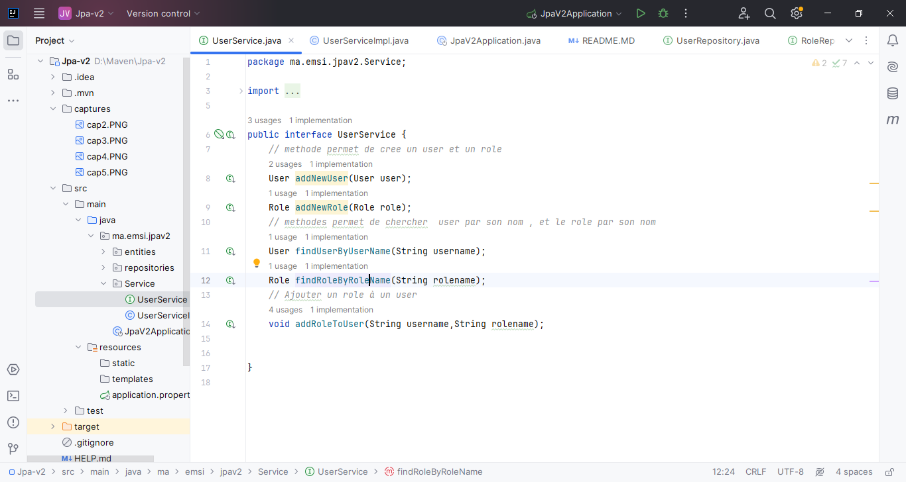
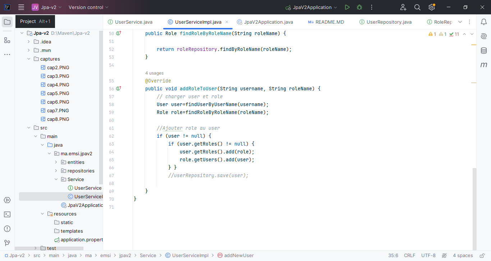
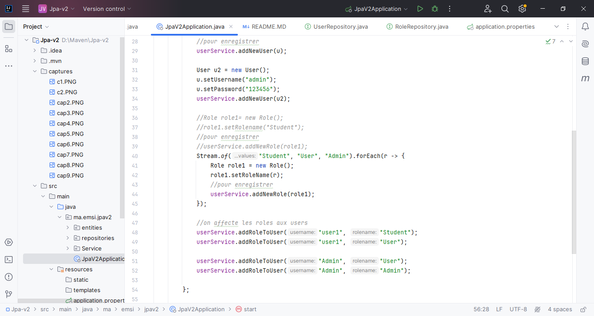
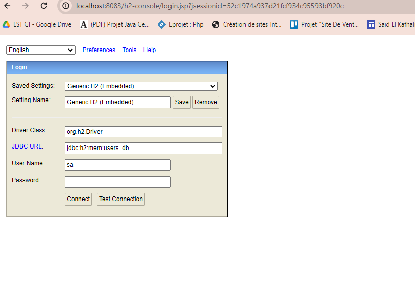
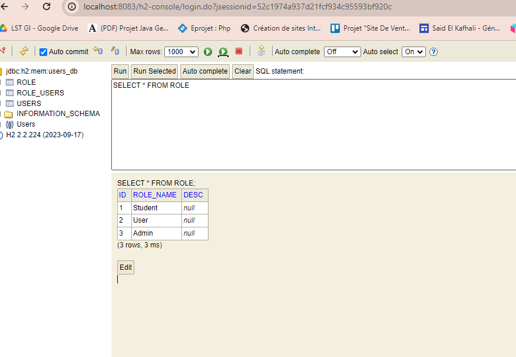

<h1>Compte Rendu</h1>
<h4>On cree un nouveau package "entities</h4>
<h4>Dans laquel on ajoute deux classe "User" et "Role" pour appliquer le mapping objet relationnel</h4>
<h4>La classe "User"</h4>

<h4>La classe "Role"</h4>

<h4>On cree un autre package pour les interfaces "repositories"</h4>
<h4>L'interface "UserRepository"</h4>

<h4>L'interface "RoleRepository"</h4>

<h4>Pour la couche metier on cree un nouveau package "Service"</h4>
<h4>Il contient une interface "UserService"</h4>

<h4>et une classe qui implemente cette interface "UserServiceImpl"</h4>

<h4>On spécifie la base dans "application.properties"</h4>

<h4>Et pour verifier on va tester l'appliaction </h4>
<h4>On run la classe "JpaV2Application" </h4>

<h4>Aprés dans browser on accéde à localhost:8083/h2-console</h4>

<h4>On connect</h4>

<h4>Dans l'interface "UserService" on ajoute une methode authenticate</h4>

<h4>on le redefinir "UserServiceImpl" </h4>

<h4>Pour ne pas inclure la liste de users on fait l'annotaion de lombok dans "Role"</h4>
 
<h4>On va tester "JpaV2Application</h4>

<h4>Si on s'authentifie par un password qui n'existe pas</h4>

<h4>Il s'affiche une exception</h4>

<h4>On met le ancien password et on run "JpaV2Application"</h4>
<h4>On accéde au localhost:8083/h2-console</h4>

<h4>On teste par Mysql</h4>
<h4>On va aller au "pom.xml" on commente h2 database</h4>
<h4>Et on ajoute dependance de mysql</h4>

<h4>Pour tester on ajoute à "application.properties" ses instructions</h4>

<h4>On demarre XAMPP</h4>
<h4>Et on run l'application </h4>

<h4>Pour eviter l'exception de l'attribut desc qui est dans la classe "Role" par sql on ajoute l'anotation @Column</h4>

<h4>On ajoute un nouveau package pour la couche web "web"</h4>
<h4>On ajoute dans ce package une classe "UserController"</h4>

<h4>On run l'application</h4>
<h4>Dans browser</h4>

<h4>On a une relation bidirectionnelle et pour éviter cette affichage on ajoute une annotation à la classe "Role" </h4>

